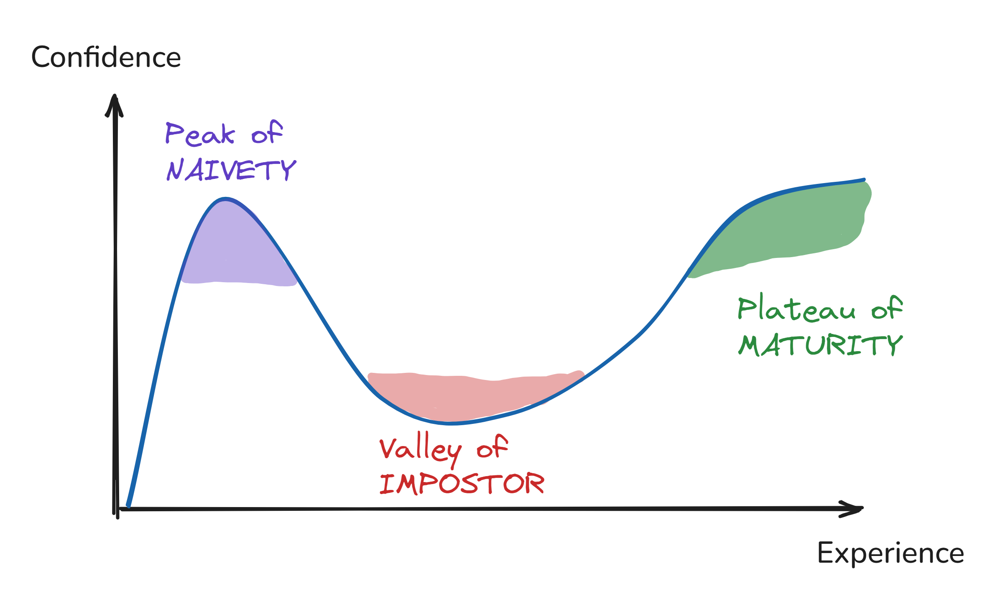
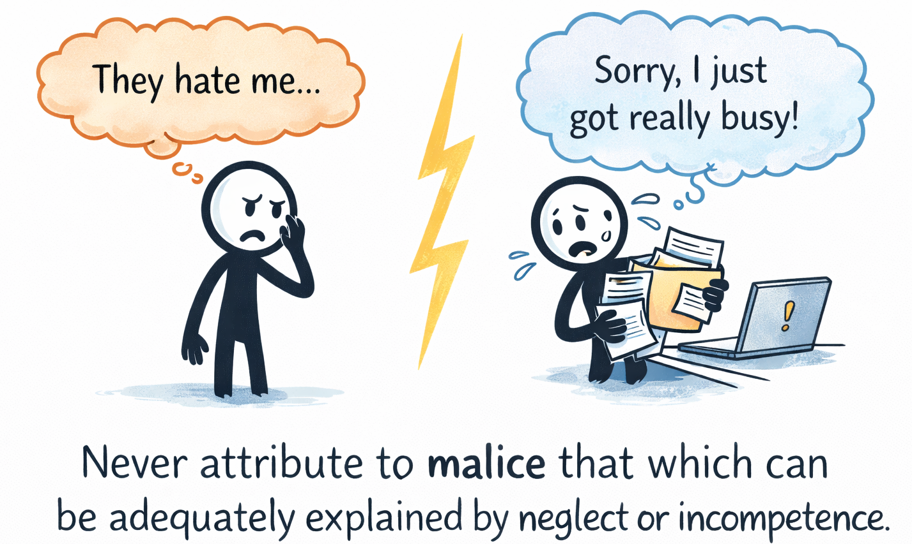
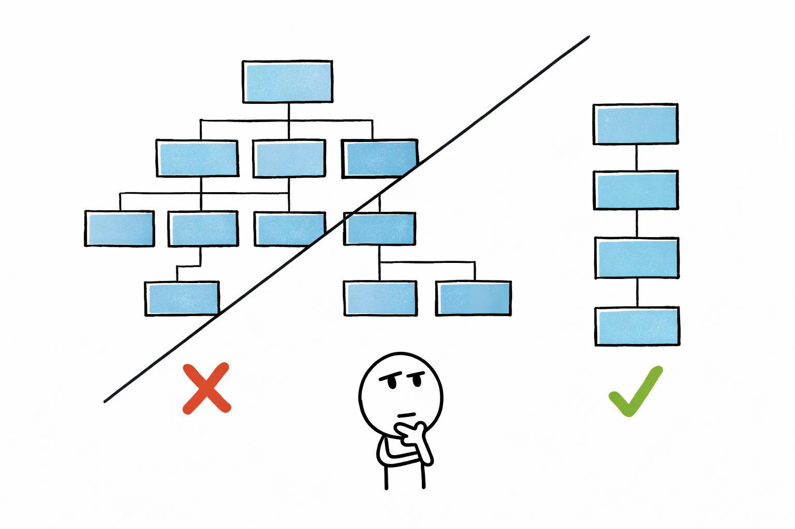
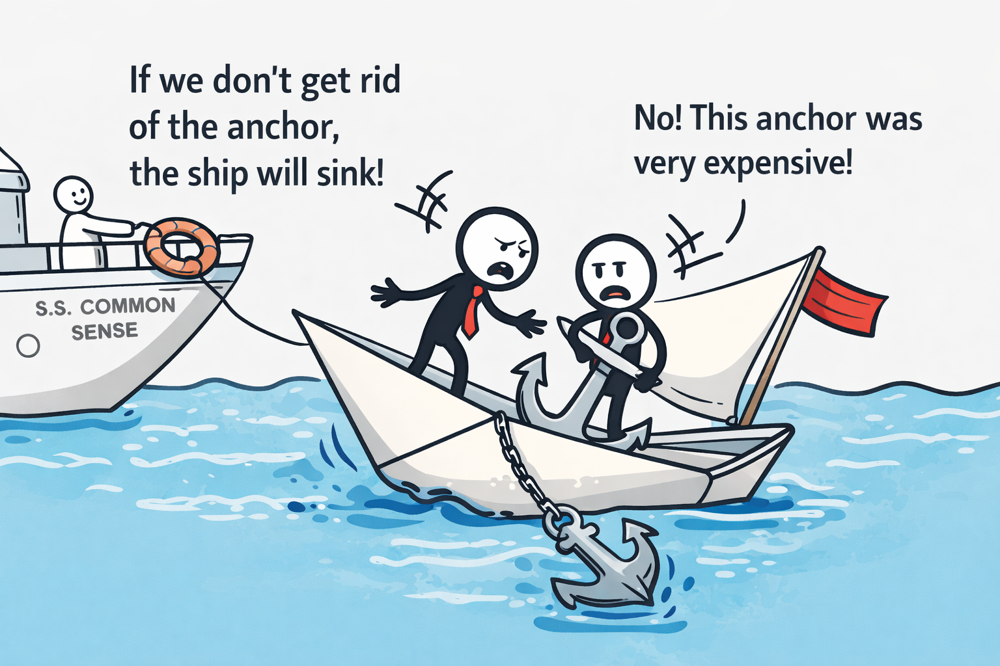
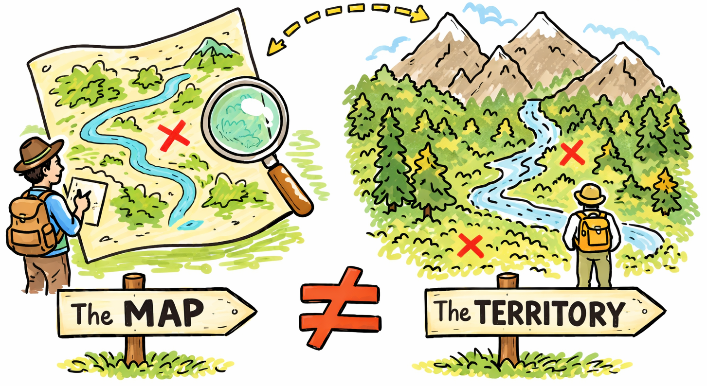
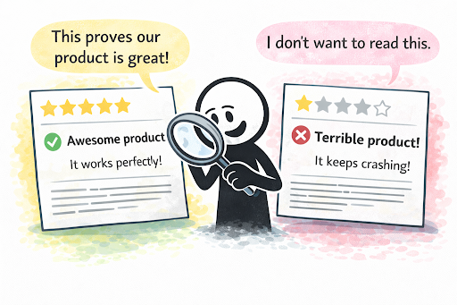

# Laws of Software Engineering 软件工程定律
## Decisions 决策
### Dunning-Kruger Effect  邓宁-克鲁格效应
The less you know about something, the more confident you tend to be.
对某件事了解得越少，往往就越自信。

> peak 顶峰 naivety 天真
> valley 山谷 impostor 骗子
> plateau 高原 maturity 到期；成熟度

### Hanlon's Razor  汉隆剃刀
Never attribute to malice that which is adequately explained by stupidity or carelessness.
永远不要把可以用愚蠢或粗心大意解释的事情归咎于恶意。

> malice 恶意；恶意
> He acted out of malice.他出于恶意行事。
> adequately 充分地；足够地
> She explained the issue adequately
> incompetence 无能力；不胜任
> Due to incompetence, the project was delayed.由于无能力，项目被延误了

### Occam's Razor  奥卡姆剃刀
The simplest explanation is often the most accurate one.
最简单的解释往往是最准确的。

### Sunk Cost Fallacy  沉没成本谬误
Sticking with a choice because you've invested time or energy in it, even when walking away helps you.
即使放弃对你更有利，但因为你已经投入了时间和精力，所以仍然坚持自己的选择。

> stick 坚持；粘附
> He was sticking to the plan.他坚持按计划行事。
> invest 投资
> He invested in the stock market.他在股市投资了。

### The Map Is Not the Territory 地图并非疆域本身
Our representations of reality are not the same as reality itself.
我们对现实的认知与现实本身并不相同。

### Confirmation Bias  确认偏差
A tendency to favor information that supports our existing beliefs or ideas.
倾向于选择支持我们现有信念或想法的信息。

